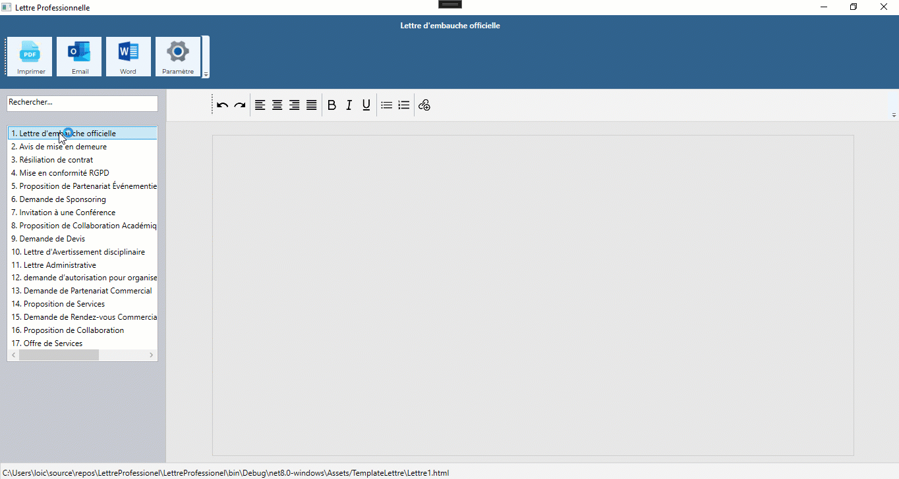

# LettreProfessionnel

Logiciel pour rédiger facilement des lettres commerciales, administratives et juridiques.

<div align="center">
  
</div>

## Fonctionnalités principales
- Modèles prêts à l’emploi pour tous types de lettres.
- Imprimer en PDF
- Export en Word
- Envoi par Mail (Outlook)

## Barre de boutons pour l'édition du modèle de lettre sélectionné
| Bouton | Fonction |
|--------|----------|
| Annuler | Revenir à l’état précédent avant la dernière modification |
| Refaire | Rétablir l’action qui a été annulée |
| Aligner le texte à gauche | Positionner le texte contre le bord gauche de la zone |
| Aligner le texte à droite | Positionner le texte contre le bord droit de la zone |
| Centrer le texte | Placer le texte au milieu horizontalement dans la zone |
| Justifier le texte | Étendre le texte pour qu’il touche à la fois le bord gauche et droit |
| Gras | Mettre le texte en évidence avec des caractères plus épais |
| Italique | Incliner légèrement le texte pour le mettre en valeur ou le distinguer |
| Liste à puce | Créer une liste avec des points pour chaque élément |
| Liste numérotée | Créer une liste avec des numéros pour chaque élément |
| Souligné | Tracer une ligne sous le texte pour le mettre en évidence |
| Ajouter un lien | Permettre de cliquer sur le texte pour ouvrir une page web |

## Installation
```bash
git clone https://github.com/hossainngari/LettreProfessionnel.git
